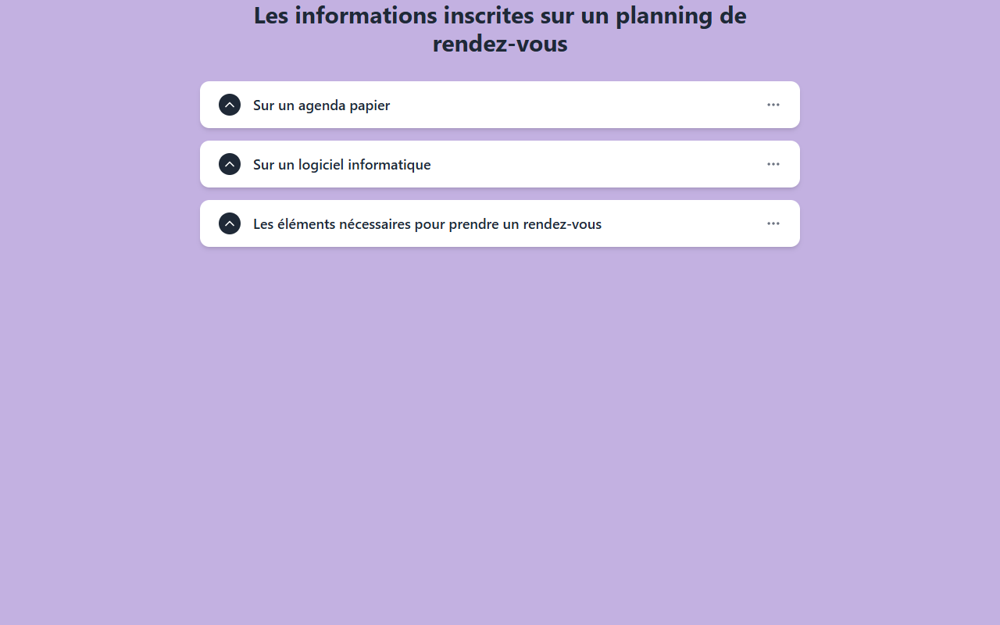

# Accordion — Gestion des Rendez-Vous

**Course:** Gerer vos RDV  
**Slide:** 3  
**Live URL:** https://accordion-gestiondesrendezvous.edtechiecorp.com  
**Stack:** Next.js · Tailwind CSS · TypeScript · GitHub Pages  

## What this slide does

Presents appointment management content through an interactive accordion interface, where learners click to expand and collapse each section. Covers key steps in organising a beauty appointment calendar, including booking windows, client reminders, and cancellation handling. The accordion format lets learners move through dense procedural content at their own pace.

## Screenshot

## Usage

This slide is embedded as an iframe inside Coassemble at the live URL above. DNS is managed via Cloudflare (`edtechiecorp.com`). To update the slide, push to the `main` branch — GitHub Actions will rebuild and redeploy automatically.
